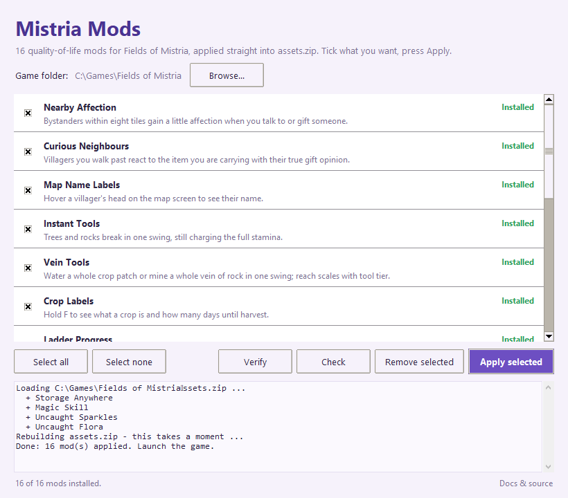

<p align="center">
  
</p>

<h1 align="center">Mistria Mods</h1>

<p align="center">
  Nineteen quality-of-life mods for <b>Fields of Mistria</b>, with one installer.<br>
  A tenth skill and a sixth spell, a chest you can open from anywhere, sparkles on the museum's missing insects, dig sites that give themselves away, and more.
</p>

<p align="center">
  
  
  
  
</p>

<p align="center">
  Also on <a href="https://www.nexusmods.com/fieldsofmistria/mods/1450">Nexus Mods</a>.
</p>

<p align="center">
  
</p>

## Install

**The easy way (Windows):** download `MistriaMods.exe` from the
[latest release](../../releases/latest), put it in your Fields of Mistria
folder — the one with `FieldsOfMistria.exe` and `assets.zip`, the same place
MOMI goes — and run it with the game **closed**. Tick the mods you want and
press **Apply**. Untick and press **Remove** to take any of them out again.

**From source (any platform):** you need Python 3.11 or newer, nothing else. Put this
folder inside the game folder as `mistria-mods`, then:

```bash
python mistria-mods/install.py apply --all
```

```bash
python mistria-mods/install.py status
```

```bash
python mistria-mods/install.py remove --all
```

Pick individual mods, or re-apply any time to change an option:

```bash
python mistria-mods/install.py apply crop-labels vein-tools --max 400
```

`python mistria-mods/install.py check --all` is a dry run: it reports whether
every anchor matches your copy of the game and changes nothing.

## Updating

New versions, and new mods, are posted as [releases](../../releases). To
update, download the new `MistriaMods.exe`, replace the old one in your game
folder, and press **Apply** once so the current mods land in your archive.
The Nexus page's main file stays at the version it was uploaded at, since
every new exe needs manual verification there; the releases here are always
current, and the source zip on Nexus is kept up to date.
The app never connects to the internet: "New versions" in its footer just
opens the releases page in your browser. `MistriaMods.exe --version` prints
the version. From source, `git pull`.

## The mods

| Mod | What it does | In-game control |
| --- | --- | --- |
| **Magic Skill** | A tenth skill. Casting spells earns XP; a five-tier, 19-perk Magic tree on Seridia's shrine — extra mana orbs, cheaper spells, longer Dragon's Breath, a wider Growth, mana that refills on waking, and more | Seridia's shrine, like any skill |
| **Homeward** | A sixth spell: cast it anywhere and Ari is carried to her own doorstep; the day goes on. Learned at Magic level 20, or with your first spell without Magic Skill | Spell menu, pinnable |
| **Storage Anywhere** | A list of every chest in the world; open any of them from where you stand. Pin your favourites to the top | `B` to open, `P` to pin — rebindable |
| **Daily Checklist** | Hold a key for today's outstanding tasks and what's coming this season | `V`, rebindable |
| **Crop Labels** | Hold a key to see what a plant is and how long until harvest | `F`, rebindable |
| **Uncaught Sparkles** | Insects the museum's Insect wing still lacks carry a white twinkle — readable with no colour vision at all | Accessibility toggle |
| **Uncaught Flora** | The same twinkle on wild forage, bushes and fruit trees the Flora wing still needs | Accessibility toggle |
| **Field Notes** | Four Almanac pages listing what the museum still lacks, each item with where and when to find it | Journal > Almanac |
| **Shovel Sense** | Hold the shovel and nearby dig sites puff loose earth; Ari notices the first one that comes close, with a thought bubble, a chime and a rumble | Accessibility toggle |
| **Ladder Progress** | Mine HUD showing how close the floor is to revealing its ladder | Accessibility toggle |
| **Vein Tools** | Water a whole crop patch, or mine a whole vein of rock, in one swing; reach scales with tool tier | Four Accessibility toggles |
| **Instant Tools** | One-swing chop and mine, still charging the full stamina | Accessibility toggle |
| **Big Rock Credit** | Large rocks and boulders count toward the mine ladder, weighted by size | Accessibility toggle |
| **Map Name Labels** | Hover a villager's head on the map to see their name | Accessibility toggle |
| **Curious Neighbours** | Villagers react to the item you're carrying with their true gift opinion | — |
| **Nearby Affection** | Bystanders gain a little affection when you talk to or gift someone | — |
| **Mistria Notices You** | Seven letters from villagers that arrive based on how you actually play | — |
| **Extra Perks** | Three new skill perks: Pathfinder, Curator's Eye, Well Spring | Bought with essence |
| **Unreleased Perks** | Two finished perks the game never put in a tree: Gemini Season, Ancient Inspiration | Bought with essence |

Every mod has a page in [`docs/`](docs/) — what it does, the design decisions,
every option, and the engine traps found play-testing it.

## Playing nicely with MOMI

These are not MOMI mods, but they live happily alongside it:

- **Run MOMI first, then this.** MOMI rebuilds `assets.zip` from its own
  pristine backup every time it installs, which removes everything here. Just
  re-apply afterwards — `Apply` in the app, or `install.py apply --all`.
- Mods whose anchors MOMI's MMAPI layer rewrites (Magic Skill's spell-cost
  lines, for instance) carry both forms and pick whichever your archive has, so
  they apply with or without MOMI installed.
- Never launch the game between a MOMI run and re-applying if you use Magic
  Skill — a save with Magic XP shouldn't be loaded while the skill doesn't
  exist.

## How it works

Fields of Mistria ships its own source as GML inside `assets.zip` and compiles
it at startup with an embedded VM. These mods edit that source in place — no
DLL injection, no code loader, no runtime dependency.

Every insertion is wrapped in marker comments, so each mod is:

- **idempotent** — re-applying strips the old block and inserts a fresh one
- **removable byte-for-byte** — `Remove` restores the original exactly
- **composable** — mods use distinct markers, and several deliberately share
  the same files, even the same lines, without conflicting

The first `Apply` writes **`assets.vanilla.zip`** beside `assets.zip`: a copy
with every known mod stripped out, so it is genuinely clean even if mods were
already installed. Restoring it over `assets.zip` puts you back to where you
started. (If you use MOMI, its own `assets.bak.zip` is the true untouched game.)

**Other languages.** Everything the mods add — labels, perk names and
descriptions, the letters — is written in English. The game looks each string
up in the active language's table and shows the word MISSING for anything it
can't find, so the installer also appends the English text to all seven
translation tables. Playing in French, Spanish, Russian, Japanese, Korean or
Chinese, you see English for the mods' text and your own language for
everything else.

## Known limitations

- **Close the game first.** Windows will not let the archive be replaced while
  the game holds it open; the installer says so rather than failing obscurely.
- **Needs about 1.3 GB free** while rewriting — the archive is ~600 MB and is
  rebuilt to a temp file before replacing — and about 700 MB of memory while
  it works, since the archive is held in RAM to be rewritten in one pass.
- **Game version.** Anchors are exact text matches against the game's source,
  tested on **1.0.4**. A game update can invalidate some; `Check` tells you
  exactly which, and nothing is written until every anchor matches.
- **Three mods leave a trace in saves.** *Mistria Notices You*: delivered letters
  are referenced by key, so removing it mid-playthrough makes the game log a
  missing-letter error. *Magic Skill*: a save that has earned Magic XP keeps a
  `magic` entry; test on a throwaway save before removing it from a leveled
  playthrough. *Homeward*: a save that learned it keeps a `homeward` entry in its spell list, same advice. The other sixteen leave no trace at all.

## Layout

```
mistria_mods_gui.py      the app (built into MistriaMods.exe)
install.py               command-line entry point
verify.py                checks the live archive against every mod
mistriamods/
  patcher.py             archive I/O, marker blocks, anchors, backup, apply/remove
  registry.py            which mods exist, where the game is
  verifier.py            the checks the app and verify.py share
  mods/*.py              one file per mod: its anchors and its injected code
docs/*.md                per-mod documentation
assets/                  the app icon
```

Adding a mod means adding one file under `mods/` and listing it in
`registry.py`. All the shared machinery lives in `patcher.py` — deliberately,
so there is exactly one place to fix a bug in it.

## Building the app and cutting a release

```bash
python -m PyInstaller --onefile --windowed --name MistriaMods --icon assets/mistria_mods.ico --add-data "assets/mistria_mods.ico;assets" mistria_mods_gui.py
```

To release: bump `VERSION` in `mistriamods/__init__.py`, build, commit, tag, and
publish `dist/MistriaMods.exe` as the release asset named exactly
`MistriaMods.exe` — that name is what installed apps look for. Adding a mod is
one file under `mods/`, a line in `registry.py`, a `SUMMARY` and `DETAILS`
for the app to show, and a doc page; then a release carries it to everyone.

## License

MIT — see [LICENSE](LICENSE). The mods contain only their own code and the
short lines of game source they anchor to; no game assets are included.
